# turkit

Project-agnostic Claude Code skills, shipped as a marketplace.

Two plugins today; more to come:

- **`turkit-workflow`** — ticket lifecycle, code review, ship, handoff, rules-refresh. The workflow backbone that works in any repo.
- **`turkit-react`** — opinionated React review. Modern React 19+ only, strict component boundaries, disciplined hooks.

## Install (Claude Code)

```bash
# One-time: register the marketplace
/plugin marketplace add alimtunc/turkit

# Install the core workflow (everyone)
/plugin install turkit-workflow@turkit

# Optional: add the React pack
/plugin install turkit-react@turkit

# Per-project setup (detects stack packs + writes .turkit.yaml, opt-in)
/turkit-workflow:install
```

## How the ticket flow fits together

```mermaid
flowchart TD
    A["📋 New ticket"] --> CHOICE{"single-session<br/>or multi-session?"}

    CHOICE -->|"single-session (Workflow-native)"| TK["/turkit-workflow:ticket<br/>intake → reuse-survey plan →<br/>one approval pause → execute → handoff"]
    CHOICE -->|"multi-session"| T["/turkit-workflow:ticket-triage"]

    T -->|"one-shot — under 1h"| E["/turkit-workflow:ticket-execute"]
    T -->|"plan-then-execute — 1h to 1d"| P["/turkit-workflow:ticket-plan"]
    T -->|"split-first — multi-day"| S["🔀 Split into sub-tickets<br/>re-triage each"]

    P -->|"operator validates the plan"| E
    E --> W["🔧 Implements on a feature branch<br/>(worktree if requested, never commits)"]
    TK --> W
    W --> V["🧪 Operator manually verifies"]

    V -. "operator-invoked review+fix loop<br/>review → fix until clean, then verify" .-> GR["/turkit-workflow:goal-review<br/>--diff / --branch / --repo"]
    V --> PCR["/turkit-workflow:pre-commit-review"]
    PCR -. "branch has multiple commits" .-> PPR["/turkit-workflow:pre-pr-review"]
    PCR --> SHIP["/turkit-workflow:ship"]
    PPR --> SHIP
    GR -. "back to the operator" .-> SHIP
    SHIP --> DONE["🚀 PR opened + ticket Done"]

    V -. "helper" .-> TI["/turkit-workflow:test-instructions"]
    SHIP -. "delegates to" .-> PRD["/turkit-workflow:pr-description"]
    V -. "escape hatch" .-> HO["/turkit-workflow:handoff<br/>resume in another session"]
```



**Typical usage:**
- **Small tickets**: `ticket-triage` → `ticket-execute` → `pre-commit-review` → `ship`.
- **Medium tickets**: `ticket-triage` → `ticket-plan` → operator validates → `ticket-execute` → `pre-commit-review` → `ship`.
- **Large tickets**: `ticket-triage` (split-first) → split into sub-tickets → re-triage each.
- **Long branches**: `pre-pr-review` instead of (or in addition to) `pre-commit-review`.
- **Running out of context**: `handoff` at any point.
- **Stack-specific review**: pair `pre-commit-review` with `/turkit-react:react-review` for React-specific findings.
- **Rules drifting**: `/turkit-workflow:rules-refresh <path>` to re-audit a rules doc against the current Claude version.
- **Existing local Claude skills**: `/turkit-workflow:adopt-project` to migrate project-specific rules into `.turkit.yaml`/docs and archive duplicated local workflow skills.

**Two ways to run the ticket flow.** The multi-session `ticket-triage` → `ticket-plan` → `ticket-execute` chain (each a discrete step, ideal across separate sessions) stays the default. New and **additive**: the single-session `/turkit-workflow:ticket` orchestrator, which runs intake/route → reuse-survey plan → **one approval pause** → execute → handoff in a single Workflow-native session. Pick `/ticket` when you want one continuous run with a single checkpoint; pick the three-step chain when you want explicit hand-offs between sessions.

**Two review entry points.** The single-shot `pre-commit-review` / `pre-pr-review` skills stay the default. New and **additive**: the operator-invoked `/turkit-workflow:goal-review` loop, which iterates review → fix until clean (on `--branch`) before a final verification pass. Pick `/goal-review` when you want it to keep fixing until the diff/branch/repo is clean; pick `pre-commit-review` / `pre-pr-review` for a single pass tied to a commit or PR.

## `turkit-workflow` skills

| Skill | What it does |
|---|---|
| `/turkit-workflow:install` | Bootstraps Turkit in a repo: detects stack-specific packs (React when applicable), prints plugin install commands, and sets up `.turkit.yaml` via the init workflow. |
| `/turkit-workflow:adopt-project` | Migrates an existing repo that already has local `.claude/skills` or `.claude/commands`: keeps project-specific knowledge, updates `.turkit.yaml`, and archives workflow duplicates outside the active skill path. |
| `/turkit-workflow:turkit-init` | Detects the project's build tool, package manager, base branch, tracker, proposes `.turkit.yaml`. |
| `/turkit-workflow:ticket` | Single-session orchestrator: intake/route → reuse-survey plan → one plan-approval pause → execute → handoff. Never commits; suggests `/goal-review` at the end. The Workflow-native alternative to the multi-session `ticket-triage` → `ticket-plan` → `ticket-execute` chain. |
| `/turkit-workflow:ticket-triage` | Routes a ticket to one-shot / plan-then-execute / split-first. |
| `/turkit-workflow:ticket-plan` | Writes a structured plan to `.claude/plans/<TICKET>.md` for operator review. |
| `/turkit-workflow:ticket-execute` | Executes a validated plan on a feature branch (worktree opt-in). Never commits. |
| `/turkit-workflow:goal-review` | Operator-invoked review+fix loop over `--diff` / `--branch` / `--repo`. Loops review → fix until clean (on `--branch`) then runs a final verification pass. Never commits. The looping alternative to the single-shot `pre-commit-review` / `pre-pr-review`. |
| `/turkit-workflow:pre-commit-review` | Strict review of the current diff. Mechanical pre-pass via the project's lint, judgment pass against an opinionated checklist (SOC, DRY, over-engineering, comments, types, error handling). Auto-fixes mechanical violations (unstaged), surfaces judgment calls as required changes. |
| `/turkit-workflow:pre-pr-review` | Strict full-branch review vs. the base branch before opening or updating a PR. Same per-diff rubric as `pre-commit-review`, plus branch-level checks (per-commit coherence, cross-commit drift, dead intermediate files, intent). Auto-fixes mechanical violations. |
| `/turkit-workflow:pr-description` | Concise PR description from the branch diff. |
| `/turkit-workflow:test-instructions` | Short manual-test checklist post-implementation. |
| `/turkit-workflow:ship` | Commit + push + PR + close the ticket. |
| `/turkit-workflow:handoff` | Summarize the current conversation for another LLM. Accepts `ship` to chain `ship` after the summary. |
| `/turkit-workflow:shipoff` | Shortcut for `/handoff ship`: ship the branch and produce the handoff summary in one go. |
| `/turkit-workflow:rules-refresh` | Audit a rules doc and propose Keep / Sharpen / Add-rationale / Redundant / Stale updates. |

## `turkit-react` skills

| Skill | What it does |
|---|---|
| `/turkit-react:react-review` | Strict React review (React 19+). Mechanical pre-pass via [`react-doctor`](https://www.npmjs.com/package/react-doctor) (oxlint-based), judgment pass against an opinionated checklist (useless `useEffect`, SOC inside `.tsx`, JSX hygiene, hooks discipline, types). Auto-fixes mechanical violations (unstaged), surfaces judgment calls as required changes. |

## Configuration

Run `/turkit-workflow:install` for full setup (stack pack recommendations + `.turkit.yaml`). Run `/turkit-workflow:turkit-init` when you only want to generate or update `.turkit.yaml`. Example output on a pnpm + TypeScript repo:

```yaml
commands:
  check: pnpm typecheck
  lint: pnpm lint
  fmt: pnpm format
  test: pnpm test
  build: pnpm build
  # Optional, used by /turkit-react:react-review when present.
  react_review: pnpm react-review
base_branch: main
workflow:
  workspace: feature_branch # or worktree_required
  worktree_dir: .worktrees
  branch_template: "{ticket_id_lower}-{slug}"
  init:
    - pnpm install
rules:
  docs:
    - CLAUDE.md
    - docs/conventions/*.md
```

All fields optional. See `.turkit.yaml.example` for the full shape and `docs/contracts/build-tool-detection.md` for the resolution order (pnpm, bun, yarn, npm, just, make, cargo, poetry, uv, go).

## Issue tracker support

Skills that touch tickets detect your tracker at runtime:

1. **MCP tools** whose names match `*issue*get*`, `*issue*save*`, etc. — known-good: Linear MCP.
2. **Branch-name fallback** — `sup-80-xxx` → `SUP-80`.
3. **No tracker** — skills degrade gracefully and operate without one.

See `docs/contracts/issue-tracker-detection.md` for the full detection rules.

## Codex / other platforms

SKILL.md files under `plugins/<plugin>/skills/` follow the standard format. For standalone use outside Claude Code, copy the full plugin folder when a skill references shared `references/` files.

`/turkit-workflow:install` also generates an `AGENTS.md` (Codex and other AGENTS-aware agents) and a `GEMINI.md` (Gemini) at the repo root, pointing those agents at the same skills and `.turkit.yaml` contracts. The skills degrade gracefully — Workflow-native execution where available, falling back to parallel and then sequential steps — so any agent can run them regardless of which orchestration primitives it supports.

**For Codex/Gemini, make the skills readable in-repo.** The `SKILL.md` files ship inside the Claude Code plugin (`~/.claude/plugins/.../turkit-workflow/skills/`), which is machine-specific and invisible to non-Claude agents. A committed `AGENTS.md` that points there won't resolve on a teammate's machine or in CI. To make it portable, run `/turkit-workflow:adopt-project`, which vendors the workflow skills into the repo's `.claude/skills/`; the generated `AGENTS.md`/`GEMINI.md` then point at that in-repo path so Codex and Gemini can read the procedures anywhere. Without vendoring, `/ticket` and `/goal-review` still work in Claude Code (the plugin is loaded directly); the in-repo copy is what other agents need.

## Contributing

- File an issue describing the use case before a PR.
- Workflow skills stay language-agnostic. Stack-specific logic belongs in its own `turkit-<stack>` plugin.
- Commit messages: short subject, no AI credit, no `Co-Authored-By`.

## License

MIT — see [LICENSE](./LICENSE).
