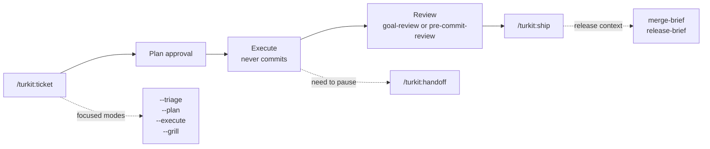

# turkit

Project-agnostic agent workflow skills for AI-assisted development. Turkit helps developers keep control of what the agent plans, changes, reviews, ships, hands off, and releases, without tying the workflow to one model, tracker, stack, or repo layout.

It ships as Claude Code marketplace plugins, but every skill uses the open [Agent-Skills](https://github.com/vercel-labs/skills) `SKILL.md` format with colocated references. Install through Claude Code, or use `npx skills add` on Codex, Cursor, Gemini, and any Agent-Skills host. See [Install on other agents](#install-on-codex--cursor--gemini--any-agent-skills-host).

Two installable packs:

- **`turkit`** — core workflow skills: project setup, ticket lifecycle, reviews, shipping, handoff, rules maintenance, and compact human-understanding gates.
- **`turkit-react`** — optional React review pack. Modern React 19+ only, strict component boundaries, disciplined hooks.

## Skills at a glance

| Area | Skills | Use when |
|---|---|---|
| Setup and adoption | `/turkit:install`, `/turkit:turkit-init`, `/turkit:adopt-project` | You want Turkit configured in a new or existing repo without losing project-specific rules. |
| Ticket workflow | `/turkit:ticket` (`--triage`, `--plan`, `--execute`, `--grill`) | You want one ticket command, with flags when you only need a narrower slice. |
| Understanding gates | `/turkit:grill-me`, `/turkit:zoom-out`, `/turkit:explain-diff`, `/turkit:teachback-gate`, `/turkit:merge-brief`, `/turkit:release-brief` | You want to slow down before coding, committing, merging, or releasing so the human can explain what is happening. |
| Review and quality | `/turkit:goal-review`, `/turkit:pre-commit-review`, `/turkit:pre-pr-review`, `/turkit-react:react-review` | You want a scoped review loop, a pre-commit check, a branch review, or React-specific judgment. |
| Shipping and continuity | `/turkit:pr-description`, `/turkit:test-instructions`, `/turkit:ship`, `/turkit:handoff`, `/turkit:rules-refresh` | You want concise PR/test docs, host-agnostic shipping, session handoff, or rules maintenance. |

## Install (Claude Code)

```bash
# One-time: register the marketplace
/plugin marketplace add alimtunc/turkit

# Install the core workflow (everyone)
/plugin install turkit@turkit

# Optional: add the React pack
/plugin install turkit-react@turkit

# Per-project setup (detects stack packs + writes .turkit.yaml, opt-in)
/turkit:install
```

`turkit` replaces the old `turkit-workflow` plugin name. Existing commands move from `/turkit-workflow:<skill>` to `/turkit:<skill>`. Existing Claude Code users should install the new plugin name with `/plugin install turkit@turkit`; the old namespace remains a v1.x install and is not auto-renamed by Claude Code.

**Not on Claude Code?** Codex / Cursor / Gemini / any Agent-Skills host install with a single `npx skills add` command — see [Install on other agents](#install-on-codex--cursor--gemini--any-agent-skills-host).

## Recommended workflow



**Ticket is one command.** Use `/turkit:ticket` by default. It reads the ticket, chooses one-shot / standard / split, produces the plan, pauses once for approval, then executes without committing. Use flags only when you want a narrower slice:

| Command | Stops after |
|---|---|
| `/turkit:ticket --triage <ticket>` | route + recommendation |
| `/turkit:ticket --plan <ticket>` | plan + optional `--grill` checkpoint |
| `/turkit:ticket --execute <ticket>` | execution + handoff from an approved plan |
| `/turkit:ticket --grill <ticket>` | default flow, with a `grill-me` checkpoint before approval |

`ticket-triage`, `ticket-plan`, and `ticket-execute` were folded into these flags in `turkit` v3.0.0. The old behavior is still available; the public command surface is smaller.

**Review stays operator-gated.** Pick `/turkit:goal-review` when you want a review -> fix loop over `--diff`, `--branch`, or `--repo`. Pick `pre-commit-review` / `pre-pr-review` for a single strict pass tied to a commit or PR. Pair with `/turkit-react:react-review` when React-specific judgment matters.

**Human understanding gates.** When AI speed makes the change hard to hold in your head, use these read-only gates before irreversible steps:

```text
Before coding      /turkit:grill-me
When lost          /turkit:zoom-out
Before commit      /turkit:explain-diff
Before ship        /turkit:teachback-gate
Before merge       /turkit:merge-brief
Before release     /turkit:release-brief
```

These skills are intentionally compact. They should help the operator decide, not produce another long audit.

## `turkit` skills

| Skill | What it does |
|---|---|
| `/turkit:install` | Bootstraps Turkit in a repo: detects stack-specific packs (React when applicable), prints plugin install commands, and sets up `.turkit.yaml` via the init workflow. |
| `/turkit:adopt-project` | Migrates an existing repo that already has local `.claude/skills` or `.claude/commands`: keeps project-specific knowledge, updates `.turkit.yaml`, and archives workflow duplicates outside the active skill path. |
| `/turkit:turkit-init` | Detects the project's build tool, package manager, base branch, tracker, proposes `.turkit.yaml`. |
| `/turkit:ticket` | Main ticket entrypoint. Default runs intake/route -> plan -> approval -> execute -> handoff. Flags: `--triage`, `--plan`, `--execute`, `--grill`. |
| `/turkit:goal-review` | Operator-invoked review+fix loop over `--diff` / `--branch` / `--repo`. Loops review → fix until clean (on `--branch`) then runs a final verification pass. Never commits. The looping alternative to the single-shot `pre-commit-review` / `pre-pr-review`. |
| `/turkit:grill-me` | Challenges a ticket, plan, or design before implementation. Asks one question at a time, with a recommended answer and reasoning. |
| `/turkit:zoom-out` | Gives a compact map of a confusing code area, diff, branch, feature, or module. |
| `/turkit:explain-diff` | Explains the staged/unstaged/branch diff in a short operator-readable brief before commit or review. |
| `/turkit:teachback-gate` | Before commit, merge, PR, push, or release: asks the operator to explain the change back in three bullets before continuing. |
| `/turkit:merge-brief` | Pre-merge brief: what enters the base branch, risk, verification, rollback, and files to reread. |
| `/turkit:release-brief` | Pre-release brief: target, version/tag, public delta, risk, verification, and rollback. |
| `/turkit:pre-commit-review` | Strict review of the current diff. Mechanical pre-pass via the project's lint, judgment pass against an opinionated checklist (SOC, DRY, over-engineering, comments, types, error handling). Auto-fixes mechanical violations (unstaged), surfaces judgment calls as required changes. |
| `/turkit:pre-pr-review` | Strict full-branch review vs. the base branch before opening or updating a PR. Same per-diff rubric as `pre-commit-review`, plus branch-level checks (per-commit coherence, cross-commit drift, dead intermediate files, intent). Auto-fixes mechanical violations. |
| `/turkit:pr-description` | Concise PR description from the branch diff. |
| `/turkit:test-instructions` | Short manual-test checklist post-implementation. |
| `/turkit:ship` | Commit + push + PR + close the ticket. Host-agnostic: resolves the PR command via `.turkit.yaml → vcs`, then `gh`, then `glab`, then a manual fallback. |
| `/turkit:handoff` | Summarize the current conversation for another LLM. **Read-only by default** (never commits, pushes, removes worktrees, or touches the tracker). Accepts `ship` to delegate shipping to `ship` after the summary. `/turkit:shipoff` is a thin command alias for `/turkit:handoff ship`. |
| `/turkit:rules-refresh` | Audit a rules doc and propose Keep / Sharpen / Add-rationale / Redundant / Stale updates. |

## `turkit-react` skills

| Skill | What it does |
|---|---|
| `/turkit-react:react-review` | Strict React review (React 19+). Mechanical pre-pass via [`react-doctor`](https://www.npmjs.com/package/react-doctor) (oxlint-based), judgment pass against an opinionated checklist (useless `useEffect`, SOC inside `.tsx`, JSX hygiene, hooks discipline, types). Auto-fixes mechanical violations (unstaged), surfaces judgment calls as required changes. |

## Configuration

Run `/turkit:install` for full setup (stack pack recommendations + `.turkit.yaml`). Run `/turkit:turkit-init` when you only want to generate or update `.turkit.yaml`. Example output on a pnpm + TypeScript repo:

```yaml
commands:
  check: pnpm typecheck
  lint: pnpm lint
  fmt: pnpm format
  test: pnpm test
  build: pnpm build
  # Optional, used by /turkit-react:react-review when present.
  react_review: pnpm react-review
base_branch: main
workflow:
  workspace: feature_branch # or worktree_required
  worktree_dir: .worktrees
  branch_template: "{ticket_id_lower}-{slug}"
  init:
    - pnpm install
rules:
  docs:
    - CLAUDE.md
    - docs/conventions/*.md
# Optional: override the PR host (otherwise gh → glab → manual fallback).
vcs:
  pr_create: gh pr create --title "$TITLE" --body-file "$BODY_FILE"
  pr_view: gh pr view "$PR_NUMBER"
# Optional: review strictness knobs (defaults shown).
review:
  strictness: standard # relaxed | standard | strict
  comments: allow-why-only # allow | allow-why-only | zero-new-comments
  react:
    min_version: 19
```

All fields optional. See `.turkit.yaml.example` for the full shape and `docs/contracts/build-tool-detection.md` for the resolution order (pnpm, bun, yarn, npm, just, make, cargo, poetry, uv, go).

**Review strictness.** The review skills/rubrics default to the current strict behavior (`strictness: standard`, `comments: allow-why-only`, React 19+). Projects can opt down — `relaxed` downgrades P1 cleanup findings to suggestions (P0 structural/behavioral findings always stay blocking), `zero-new-comments` forbids any added comment — without editing the skill files. `review.react.min_version` keeps React 19+ as the `turkit-react` default while making the rule configurable.

## Issue tracker support

Skills that touch tickets detect your tracker at runtime:

1. **MCP tools** whose names match `*issue*get*`, `*issue*save*`, etc. — known-good: Linear MCP.
2. **Branch-name fallback** — `sup-80-xxx` → `SUP-80`.
3. **No tracker** — skills degrade gracefully and operate without one.

See `docs/contracts/issue-tracker-detection.md` for the full detection rules.

## VCS host support

`ship` (PR create) and `handoff` (PR view) are not tied to GitHub. They resolve the host command in this order:

1. **`.turkit.yaml → vcs.pr_create` / `vcs.pr_view`** — explicit override (variables: `$TITLE`, `$BODY_FILE`, `$PR_NUMBER`).
2. **GitHub CLI** (`gh`) when available.
3. **GitLab CLI** (`glab`) when available.
4. **Manual fallback** — prints the PR title/body and the pushed branch so you can open it in your host UI. No hard failure when no CLI is installed.

PR body generation stays delegated to `pr-description`. See `docs/contracts/vcs-host-detection.md` for the full resolution and config shape.

## Install on Codex / Cursor / Gemini / any Agent-Skills host

Turkit skills use the open Agent-Skills format (`SKILL.md`), so they install on any agent that supports it via [`npx skills`](https://github.com/vercel-labs/skills) — no Claude Code required. Turkit's `.claude-plugin/marketplace.json` makes the skills discoverable directly from the repo, and each skill is **self-contained** (its `references/` travel with it), so per-skill install works on every host.

```bash
npx skills add alimtunc/turkit -a codex          # Codex
npx skills add alimtunc/turkit -a claude-code    # Claude Code (alternative to /plugin install)
npx skills add alimtunc/turkit -a cursor         # Cursor
npx skills add alimtunc/turkit -a gemini         # Gemini CLI
```

| Agent | Skills land in | Update |
|---|---|---|
| Codex | the agent's skills dir (`.agents/skills` / `~/.codex/skills`) | re-run `npx skills add …` |
| Claude Code | `~/.claude/skills/` (or use `/plugin install …@turkit`) | re-run, or `/plugin` update |
| Cursor / Gemini / Copilot / … | each agent's own skills dir | re-run `npx skills add …` |

After installing, run the `turkit-init` skill in your agent to generate `.turkit.yaml` (and optionally `AGENTS.md`) for the project. The Claude Code plugin marketplace flow (`/plugin install turkit@turkit`) is the Claude-native option.

**Maintainers — canonical sources vs. denormalized copies.** Two kinds of shared content are single-sourced and vendored into each consumer skill so per-skill installs stay self-contained:

- **Shared rubrics/templates** — canonical under `plugins/<plugin>/references/` (e.g. `review-rubric.md`, `branch-review.md`, `worktree-bootstrap.md`).
- **Detection contracts** — canonical under `docs/contracts/` (`build-tool-detection.md`, `issue-tracker-detection.md`, `vcs-host-detection.md`). Skills cite them as `references/<contract>.md`, never the repo-root path.

`scripts/sync-references.sh` copies both into each skill's own `references/` (rewriting any `../../references/` sibling links to `references/`); `scripts/check-references.sh` fails on drift — a colocated copy that differs from its canonical source, a leftover `../../references/` link, or a skill that still cites repo-root `docs/contracts/*` directly. `react-rubric.md` has no canonical under either root, so it is its own source and is left untouched. Run `scripts/sync-references.sh` before publishing a release; the React rubric is edited in place.

## Contributing

- File an issue describing the use case before a PR.
- Workflow skills stay language-agnostic. Stack-specific logic belongs in its own `turkit-<stack>` plugin.
- Commit messages: short subject, no AI credit, no `Co-Authored-By`.

## License

MIT — see [LICENSE](./LICENSE).
