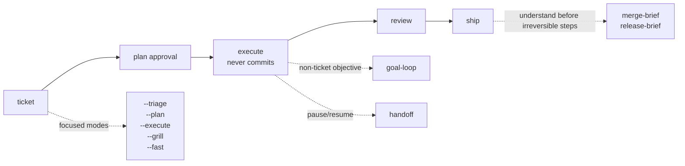

# turkit

Project-agnostic Agent-Skills for AI-assisted development. Turkit adds a reusable workflow around coding agents: ticket planning, review, shipping, handoff, and small human-understanding gates before commits, merges, and releases.

The skills use the open [Agent-Skills](https://github.com/vercel-labs/skills) `SKILL.md` format with colocated references. They run on Codex, Claude Code, Cursor, Gemini, and any Agent-Skills host. Claude Code plugin install is supported, but the simplest path is `npx skills add`.

## Install

```bash
npx skills add alimtunc/turkit
```

The CLI lets you choose one or more target agents interactively. You can use the skills immediately after install. The `install` skill is optional: run it only when you want a repo diagnostic or a proposed `.turkit.yaml` / `AGENTS.md` setup.

### Claude Code Plugin Alternative

Claude Code users can install through the plugin marketplace instead of `npx`:

```bash
/plugin marketplace add alimtunc/turkit
/plugin install turkit@turkit

# Optional React pack
/plugin install turkit-react@turkit
```

`turkit` replaces the old `turkit-workflow` plugin name. Existing v1 commands moved from the old namespace to `turkit`.

## Recommended Workflow



Use `ticket` by default. It reads the ticket, chooses one-shot / standard / split, produces a plan, pauses once for approval, then executes without committing.

| Command | Use when |
|---|---|
| `ticket <ticket>` | Default ticket flow: plan -> approval -> execute -> handoff. |
| `ticket --triage <ticket>` | Classify scope and stop. |
| `ticket --plan <ticket>` | Write/present the plan and stop before edits. |
| `ticket --execute <ticket>` | Execute an already-approved `.claude/plans/<TICKET>.md`. |
| `ticket --grill <ticket>` | Challenge the plan before approval. |
| `ticket --fast <ticket>` | Run the default ticket flow with compact output and a narrower reuse survey. |

`ticket-triage`, `ticket-plan`, and `ticket-execute` were folded into these flags in `turkit` v3.0.0. Same behavior, smaller public command surface.

Use `ticket --fast` for small or obvious work when you want lower token usage. It keeps plan approval and verification; it only narrows exploration and shortens the operator-facing output.

## Skills

Names below are skill names. Claude Code exposes them as slash commands; other Agent-Skills hosts invoke the same skill names directly.

| Skill | What it does |
|---|---|
| `ticket` | Main ticket workflow: plan, approval, execute, and handoff; supports `--triage`, `--plan`, `--execute`, `--grill`, and `--fast`. |
| `goal-loop` | Iterates on a bounded non-ticket objective until criteria pass, budget is exhausted, or a human decision is needed. |
| `goal-review` | Review/fix loop for a diff, branch, or repo; useful when you want the agent to keep fixing until clean. |
| `pre-commit-review` | Strict review of the current working-tree diff before committing. |
| `pre-pr-review` | Strict full-branch review before opening or updating a PR. |
| `react-review` | React 19+ review focused on component boundaries, hooks, JSX hygiene, types, and unnecessary effects. |
| `resolve-conflict` | Resolves current git merge/rebase/cherry-pick conflicts without staging, continuing, committing, or pushing. |
| `clean-skill` | Audits and removes stale Turkit skills left behind by additive installs, after explicit confirmation. |
| `preview-test` | Functionally tests a deployed PR preview from config or an operator-provided URL and returns a structured verdict. |
| `zoom-out` | Builds a compact map when the code area, diff, branch, or feature feels confusing. |
| `explain-diff` | Explains staged, unstaged, or branch changes as a compact before/after brief. |
| `teachback-gate` | Asks the operator to explain the change back before commit, PR, push, or release. |
| `merge-brief` | Summarizes what enters the base branch, risks, verification, rollback, and files to reread. |
| `release-brief` | Summarizes release target, public delta, risk, verification, and rollback. |
| `pr-description` | Writes a concise PR description from the branch diff. |
| `test-instructions` | Produces a short manual-test checklist after implementation. |
| `ship` | Commit, push, open a PR, and close the ticket with host fallbacks. |
| `handoff` | Creates a read-only session handoff for another agent or a later session. |
| `rules-refresh` | Reviews a rules document and proposes keep, sharpen, redundant, or stale updates. |
| `install` | Optional setup diagnostic: proposes `.turkit.yaml`, `AGENTS.md`, or `GEMINI.md` changes. |
| `turkit-init` | Proposes a `.turkit.yaml` from detected commands, base branch, tracker, workflow, and rules docs. |
| `adopt-project` | Migrates repos that already have local Claude skills, commands, or duplicated workflow rules. |

## Preview Testing

Use `preview-test` when a PR has a deployed preview and you want the agent to test the live user flow before merge or release. Turkit never assumes your preview host. Either pass a URL directly, or configure a template:

```yaml
preview:
  url_template: "pr-{pr_number}.beta.example.com"
  wait_for: ""
  vision: auto
```

`{pr_number}` is resolved from the active PR context when possible, then substituted into the URL. If no template or URL is available, `preview-test` asks for one instead of guessing. It ends with a machine-readable verdict for review/fix loops:

```json
{
  "status": "PASS",
  "findings": []
}
```

## Human-Control Gates

These are intentionally compact and read-only. They are meant to help the operator understand and decide, not produce another long audit.

```text
When lost          zoom-out
Before commit      explain-diff
Before ship        teachback-gate
Before merge       merge-brief
Before release     release-brief
```

## Pair With Matt Pocock's Skills

Turkit focuses on the delivery workflow around an AI coding agent: tickets, bounded loops, reviews, conflicts, shipping, handoffs, and compact decision gates.

For standalone plan grilling, TDD, debugging, domain modeling, and codebase design, install [mattpocock/skills](https://github.com/mattpocock/skills) alongside Turkit:

```bash
npx skills add mattpocock/skills
```

Use Matt's `grill-me` for a general plan/design challenge. Use `ticket --grill` when the challenge belongs inside Turkit's ticket flow.

## Upgrade Cleanup

Skill installers are usually additive: reinstalling Turkit updates current skills but may not remove skills that Turkit no longer ships. Run `clean-skill` when an old Turkit command still appears after an update.

## Optional Project Config

You do **not** need `.turkit.yaml` to try Turkit. The skills detect common package managers, base branches, issue trackers, and PR hosts at runtime, then degrade to manual fallbacks when something is missing.

Add `.turkit.yaml` only when you want to pin project-specific behavior:

- commands such as `dev`, `check`, `lint`, `test`, `build`, or `react_review`
- rule docs to load before planning/reviewing
- branch/worktree policy
- token budget and output style
- PR host overrides for GitHub, GitLab, Bitbucket, Gerrit, etc.
- deployed PR preview URL template and optional readiness/vision settings
- review strictness knobs

Minimal example:

```yaml
commands:
  dev: pnpm dev
  check: pnpm typecheck
  lint: pnpm lint
  test: pnpm test
workflow:
  token_budget: low
output:
  style: compact
base_branch: main
rules:
  docs:
    - CLAUDE.md
    - AGENTS.md
    - docs/conventions/*.md
```

Run `install` for guided setup, or `turkit-init` when you only want a proposed `.turkit.yaml`. See [.turkit.yaml.example](.turkit.yaml.example) for the full schema.

## Portability Notes

- **Issue trackers are optional.** Turkit resolves tickets from MCP tracker tools when available, then branch names, then operator-provided descriptions. No tracker is a supported mode.
- **PR hosts are optional.** `ship` resolves PR creation through `.turkit.yaml`, then `gh`, then `glab`, then prints a manual fallback.
- **Preview hosts are optional.** `preview-test` reads `.turkit.yaml → preview.url_template`; without it, it asks for a URL or returns a structured finding.
- **Parallel orchestration is optional.** When a host has Workflow/Task/Agent tools, Turkit uses them for faster surveys and reviews. Without them, skills run the same steps sequentially.
- **Goal loops are bounded.** `goal-loop` defaults to a small round budget and stops on ambiguity, repeated verification failure, or scope expansion.
- **References are self-contained.** Shared rubrics and detection contracts are vendored into each skill so per-skill installs work outside this repo.

## Maintainers

Canonical shared files live in two places:

- `plugins/<plugin>/references/` for shared rubrics/templates
- `docs/contracts/` for detection contracts

Run these before publishing:

```bash
scripts/sync-references.sh
scripts/check-references.sh
scripts/test-sync-references.sh
```

`scripts/sync-references.sh` vendors canonical references into each consuming skill. `scripts/check-references.sh` fails on drift, leftover `../../references/` links, or direct `docs/contracts/*` citations from skill files.

## Contributing

- File an issue describing the use case before a PR.
- Workflow skills stay language-agnostic. Stack-specific logic belongs in its own `turkit-<stack>` plugin.
- Commit messages: short subject, no AI credit, no `Co-Authored-By`.

## License

MIT — see [LICENSE](./LICENSE).
