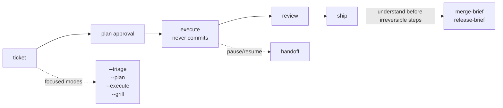

# turkit

Project-agnostic Agent-Skills for AI-assisted development. Turkit adds a reusable workflow around coding agents: ticket planning, review, shipping, handoff, and small human-understanding gates before commits, merges, and releases.

The skills use the open [Agent-Skills](https://github.com/vercel-labs/skills) `SKILL.md` format with colocated references. They run on Codex, Claude Code, Cursor, Gemini, and any Agent-Skills host. Claude Code plugin install is supported, but the simplest path is `npx skills add`.

## Install

```bash
npx skills add alimtunc/turkit -a codex          # Codex
npx skills add alimtunc/turkit -a claude-code    # Claude Code
npx skills add alimtunc/turkit -a cursor         # Cursor
npx skills add alimtunc/turkit -a gemini         # Gemini CLI
```

Then run the `install` skill in your agent. In Claude Code, that is:

```bash
/turkit:install
```

`install` detects the project, recommends stack packs such as `turkit-react`, and can propose a `.turkit.yaml` only when useful. It does not overwrite project files without confirmation.

### Claude Code Plugin Alternative

Claude Code users can install through the plugin marketplace instead of `npx`:

```bash
/plugin marketplace add alimtunc/turkit
/plugin install turkit@turkit

# Optional React pack
/plugin install turkit-react@turkit
```

`turkit` replaces the old `turkit-workflow` plugin name. Existing v1 commands moved from `/turkit-workflow:<skill>` to `/turkit:<skill>`.

## Recommended Workflow



Use `/turkit:ticket` by default. It reads the ticket, chooses one-shot / standard / split, produces a plan, pauses once for approval, then executes without committing.

| Command | Use when |
|---|---|
| `/turkit:ticket <ticket>` | Default ticket flow: plan -> approval -> execute -> handoff. |
| `/turkit:ticket --triage <ticket>` | Classify scope and stop. |
| `/turkit:ticket --plan <ticket>` | Write/present the plan and stop before edits. |
| `/turkit:ticket --execute <ticket>` | Execute an already-approved `.claude/plans/<TICKET>.md`. |
| `/turkit:ticket --grill <ticket>` | Add a `grill-me` challenge before plan approval. |

`ticket-triage`, `ticket-plan`, and `ticket-execute` were folded into these flags in `turkit` v3.0.0. Same behavior, smaller public command surface.

## Skills

Names below are skill names. In Claude Code, use `/turkit:<skill>` for core workflow skills and `/turkit-react:react-review` for the React pack. On other Agent-Skills hosts, invoke the same skill by name.

| Area | Skills | What they are for |
|---|---|---|
| Setup | `install`, `turkit-init`, `adopt-project` | Configure Turkit, generate optional project config, or migrate existing local Claude skills/rules. |
| Ticket workflow | `ticket` | One ticket entrypoint with `--triage`, `--plan`, `--execute`, and `--grill` modes. |
| Review | `goal-review`, `pre-commit-review`, `pre-pr-review`, `react-review` | Review/fix loops, strict pre-commit or pre-PR review, and optional React-specific review. |
| Understand the change | `grill-me`, `zoom-out`, `explain-diff`, `teachback-gate` | Slow down before coding, recover context, explain a diff, or force a short human teachback. |
| Ship and continue | `pr-description`, `test-instructions`, `ship`, `handoff` | Generate PR/test notes, commit/push/open PR, or hand work to another session. |
| Merge/release/rules | `merge-brief`, `release-brief`, `rules-refresh` | Understand what is entering the base branch, what is being released, or refresh project rules. |

The optional `turkit-react` pack currently contains `react-review`, a strict React 19+ review skill focused on component boundaries, hooks discipline, JSX hygiene, types, and unnecessary effects.

## Human-Control Gates

These are intentionally compact and read-only. They are meant to help the operator understand and decide, not produce another long audit.

```text
Before coding      /turkit:grill-me
When lost          /turkit:zoom-out
Before commit      /turkit:explain-diff
Before ship        /turkit:teachback-gate
Before merge       /turkit:merge-brief
Before release     /turkit:release-brief
```

## Optional Project Config

You do **not** need `.turkit.yaml` to try Turkit. The skills detect common package managers, base branches, issue trackers, and PR hosts at runtime, then degrade to manual fallbacks when something is missing.

Add `.turkit.yaml` only when you want to pin project-specific behavior:

- commands such as `check`, `lint`, `test`, `build`, or `react_review`
- rule docs to load before planning/reviewing
- branch/worktree policy
- PR host overrides for GitHub, GitLab, Bitbucket, Gerrit, etc.
- review strictness knobs

Minimal example:

```yaml
commands:
  check: pnpm typecheck
  lint: pnpm lint
  test: pnpm test
base_branch: main
rules:
  docs:
    - CLAUDE.md
    - AGENTS.md
    - docs/conventions/*.md
```

Run `/turkit:install` for guided setup, or `/turkit:turkit-init` when you only want a proposed `.turkit.yaml`. See [.turkit.yaml.example](.turkit.yaml.example) for the full schema.

## Portability Notes

- **Issue trackers are optional.** Turkit resolves tickets from MCP tracker tools when available, then branch names, then operator-provided descriptions. No tracker is a supported mode.
- **PR hosts are optional.** `ship` resolves PR creation through `.turkit.yaml`, then `gh`, then `glab`, then prints a manual fallback.
- **Parallel orchestration is optional.** When a host has Workflow/Task/Agent tools, Turkit uses them for faster surveys and reviews. Without them, skills run the same steps sequentially.
- **References are self-contained.** Shared rubrics and detection contracts are vendored into each skill so per-skill installs work outside this repo.

## Maintainers

Canonical shared files live in two places:

- `plugins/<plugin>/references/` for shared rubrics/templates
- `docs/contracts/` for detection contracts

Run these before publishing:

```bash
scripts/sync-references.sh
scripts/check-references.sh
scripts/test-sync-references.sh
```

`scripts/sync-references.sh` vendors canonical references into each consuming skill. `scripts/check-references.sh` fails on drift, leftover `../../references/` links, or direct `docs/contracts/*` citations from skill files.

## Contributing

- File an issue describing the use case before a PR.
- Workflow skills stay language-agnostic. Stack-specific logic belongs in its own `turkit-<stack>` plugin.
- Commit messages: short subject, no AI credit, no `Co-Authored-By`.

## License

MIT — see [LICENSE](./LICENSE).
